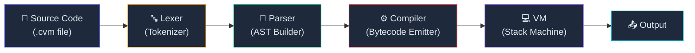
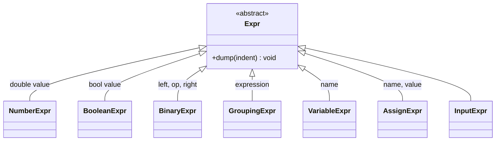
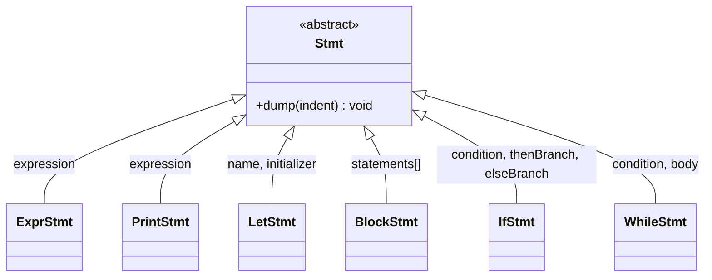
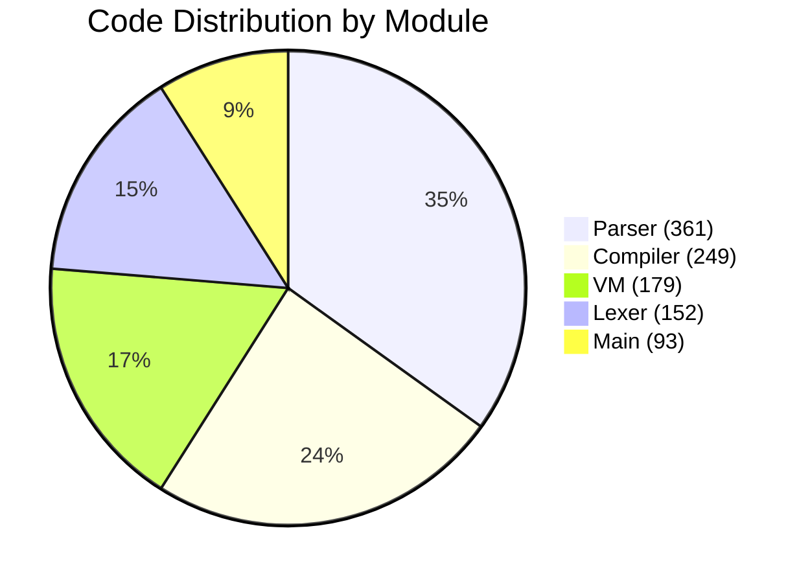

# CVM++ — Technical Project Report

> **Project**: CVM++ Compiler & Virtual Machine  
> **Language**: C++17  
> **Author**: Charan Ponaganti  
> **Date**: May 18, 2026

---

## 1. Executive Summary

CVM++ is a **fully self-contained programming language ecosystem** built from scratch in C++17. It implements the complete compilation pipeline — from raw source text to bytecode execution — within a single binary. The project demonstrates mastery of core compiler design concepts including lexical analysis, recursive descent parsing, AST construction, bytecode compilation with jump patching, and stack-based virtual machine execution.

| Metric | Value |
|---|---|
| Total Source Files | **13** (`.cpp` + `.h`) |
| Total Lines of Code | **1,034** |
| Pipeline Stages | **4** (Lexer → Parser → Compiler → VM) |
| Bytecode Instructions | **17** opcodes |
| Example Programs | **5** |
| Execution Modes | **2** (File runner + Interactive REPL) |

---

## 2. Architecture Overview

The system follows a classic **multi-stage compilation pipeline** with a clean separation of concerns across four independent modules:



### Project Structure

```
cvm/
├── main.exe                    Compiled executable (877 KB)
├── README.txt                  Comprehensive documentation
├── examples/
│   ├── calculator.cvm          Interactive calculator (48 lines)
│   ├── truth_machine.cvm       Classic truth machine (12 lines)
│   ├── sum.cvm                 Summation loop 1..10 (11 lines)
│   ├── demo.cvm                Feature showcase (20 lines)
│   └── input_demo.cvm          I/O demonstration (11 lines)
└── src/
    ├── main.cpp                Entry point, REPL, file runner
    ├── lexer/
    │   ├── Token.h             Token type enum + Token struct
    │   ├── lexer.h             Lexer class declaration
    │   └── lexer.cpp           Scanner implementation
    ├── parser/
    │   ├── AST.h               Expression node hierarchy
    │   ├── Stmt.h              Statement node hierarchy
    │   ├── parser.h            Parser class declaration
    │   └── parser.cpp          Recursive descent parser
    ├── compiler/
    │   ├── opcode.h            OpCode enum + Chunk container
    │   ├── compiler.h          Compiler class declaration
    │   └── compiler.cpp        AST-to-bytecode compiler
    └── vm/
        ├── vm.h                VM class declaration
        └── vm.cpp              Stack-based bytecode interpreter
```

---

## 3. Component Deep Dive

### 3.1 Lexer (Tokenizer)

| File | Lines |
|---|---|
| [Token.h](file:///c:/Users/chara/Desktop/cvm/src/lexer/Token.h) | 22 |
| [lexer.h](file:///c:/Users/chara/Desktop/cvm/src/lexer/lexer.h) | 20 |
| [lexer.cpp](file:///c:/Users/chara/Desktop/cvm/src/lexer/lexer.cpp) | 110 |
| **Subtotal** | **152** |

**Purpose**: Transforms raw source text into a flat stream of typed `Token` objects.

**Token Categories**:

| Category | Tokens |
|---|---|
| Single-character operators | `+`, `-`, `*`, `/`, `=`, `<`, `(`, `)`, `{`, `}` |
| Two-character operators | `==` |
| Literals | `NUMBER` (integer sequences) |
| Identifiers | User-defined variable names |
| Keywords | `let`, `print`, `if`, `else`, `while`, `true`, `false`, `input` |
| Special | `EOF_TOKEN` |

**Design Notes**:
- Uses a simple **single-pass character scanner** with a `switch` dispatch on each character
- Lookahead for two-character tokens (`==`) is handled via `peek()`
- Keywords are recognized by string comparison after consuming a full identifier — a straightforward approach suitable for 8 reserved words
- Whitespace (spaces, tabs, newlines, carriage returns) is silently consumed

---

### 3.2 Parser (AST Builder)

| File | Lines |
|---|---|
| [AST.h](file:///c:/Users/chara/Desktop/cvm/src/parser/AST.h) | 76 |
| [Stmt.h](file:///c:/Users/chara/Desktop/cvm/src/parser/Stmt.h) | 74 |
| [parser.h](file:///c:/Users/chara/Desktop/cvm/src/parser/parser.h) | 38 |
| [parser.cpp](file:///c:/Users/chara/Desktop/cvm/src/parser/parser.cpp) | 173 |
| **Subtotal** | **361** |

**Purpose**: Consumes the token stream and constructs a typed Abstract Syntax Tree (AST) via **recursive descent parsing**.

#### Expression Hierarchy (`Expr` base class)



#### Statement Hierarchy (`Stmt` base class)



#### Operator Precedence (lowest → highest)

| Level | Rule | Operators |
|---|---|---|
| 1 | `assignment()` | `=` (right-associative) |
| 2 | `equality()` | `==` |
| 3 | `comparison()` | `<` |
| 4 | `term()` | `+`, `-` |
| 5 | `factor()` | `*`, `/` |
| 6 | `primary()` | Literals, identifiers, `input`, `(...)` |

**Design Notes**:
- The parser supports **chained `else if`** via recursive `ifStatement()` calls
- AST nodes use `std::unique_ptr<>` for automatic memory management — zero manual `delete` calls
- Each node has a `dump()` method for debug introspection of the tree structure
- Error recovery halts at the first parse error for simplicity

---

### 3.3 Compiler (Bytecode Emitter)

| File | Lines |
|---|---|
| [opcode.h](file:///c:/Users/chara/Desktop/cvm/src/compiler/opcode.h) | 49 |
| [compiler.h](file:///c:/Users/chara/Desktop/cvm/src/compiler/compiler.h) | 20 |
| [compiler.cpp](file:///c:/Users/chara/Desktop/cvm/src/compiler/compiler.cpp) | 180 |
| **Subtotal** | **249** |

**Purpose**: Walks the AST and emits a linear bytecode stream into a `Chunk` object.

#### The `Chunk` Data Structure

The `Chunk` is the bytecode container, consisting of three pools:

| Pool | Type | Purpose |
|---|---|---|
| `code` | `vector<uint8_t>` | The bytecode instruction stream |
| `constants` | `vector<double>` | Numeric literal pool |
| `names` | `vector<string>` | Variable name pool (deduplicates) |

#### Jump Patching Strategy

Control flow (`if`/`else`/`while`) is compiled using **forward jump patching** — a two-pass approach within the single compilation pass:

```
IF statement compilation:
  1. Compile condition → pushes result onto stack
  2. Emit OP_JUMP_IF_FALSE with placeholder target (0xFFFF)
  3. Compile then-branch
  4. Emit OP_JUMP with placeholder target (skip else)
  5. PATCH step 2's target to current position ← else starts here
  6. Compile else-branch (if present)
  7. PATCH step 4's target to current position ← after else

WHILE loop compilation:
  1. Record loopStart = current bytecode position
  2. Compile condition
  3. Emit OP_JUMP_IF_FALSE with placeholder
  4. Compile body
  5. Emit OP_JUMP → loopStart (backward jump, absolute address)
  6. PATCH step 3's target to current position ← exit point
```

Jump targets are encoded as **16-bit big-endian absolute addresses**, supporting programs up to 65,535 bytes of bytecode.

#### Built-in Disassembler

The compiler includes a full `disassemble()` method that pretty-prints the bytecode with:
- Byte offset addresses (zero-padded 4-digit)
- Opcode mnemonics
- Resolved operand values (constant values, variable names, jump targets)

---

### 3.4 Virtual Machine (Bytecode Interpreter)

| File | Lines |
|---|---|
| [vm.h](file:///c:/Users/chara/Desktop/cvm/src/vm/vm.h) | 27 |
| [vm.cpp](file:///c:/Users/chara/Desktop/cvm/src/vm/vm.cpp) | 152 |
| **Subtotal** | **179** |

**Purpose**: Executes compiled bytecode using a **stack-based architecture**.

#### VM Internals

| Component | Specification |
|---|---|
| Value Stack | Fixed-size `double[256]` array |
| Stack Pointer (`sp`) | Points to next free slot |
| Instruction Pointer (`ip`) | Index into `chunk.code[]` |
| Global Variables | `unordered_map<string, double>` |
| Value Representation | All values are `double` (numbers, booleans as 1.0/0.0) |

#### Instruction Set Architecture (17 opcodes)

| Opcode | Operand | Stack Effect | Description |
|---|---|---|---|
| `OP_CONST` | 1-byte index | → val | Push `constants[index]` |
| `OP_TRUE` | — | → 1.0 | Push boolean true |
| `OP_FALSE` | — | → 0.0 | Push boolean false |
| `OP_ADD` | — | a, b → (a+b) | Addition |
| `OP_SUB` | — | a, b → (a−b) | Subtraction |
| `OP_MUL` | — | a, b → (a×b) | Multiplication |
| `OP_DIV` | — | a, b → (a÷b) | Division (with zero-check) |
| `OP_EQUAL` | — | a, b → (a==b) | Equality comparison |
| `OP_LESS` | — | a, b → (a<b) | Less-than comparison |
| `OP_PRINT` | — | val → | Pop & print to stdout |
| `OP_POP` | — | val → | Discard top of stack |
| `OP_INPUT` | — | → val | Read number from stdin |
| `OP_SET_GLOBAL` | 1-byte index | (keeps val) | Store to global variable |
| `OP_GET_GLOBAL` | 1-byte index | → val | Load from global variable |
| `OP_JUMP` | 2-byte target | — | Unconditional jump |
| `OP_JUMP_IF_FALSE` | 2-byte target | val → | Conditional jump |
| `OP_HALT` | — | — | Stop execution |

#### Runtime Safety

The VM includes several safety checks:
- **Stack overflow** detection (sp ≥ 256)
- **Stack underflow** detection (sp ≤ 0)
- **Division by zero** halts with a runtime error
- **Undefined variable** access raises a runtime error
- **Invalid input** (non-numeric) is caught and reported

---

### 3.5 Entry Point & REPL

| File | Lines |
|---|---|
| [main.cpp](file:///c:/Users/chara/Desktop/cvm/src/main.cpp) | 93 |

**Two execution modes**:

1. **File Runner** — `main.exe <file.cvm> [--debug]` reads, compiles, and executes a source file
2. **Interactive REPL** — `main.exe` launches a read-eval-print loop with `:debug` toggle

The `run()` function orchestrates the full pipeline in 4 clean steps:
```
Lexer lexer(source)       →  tokens
Parser parser(tokens)     →  AST statements
Compiler compiler         →  Chunk (bytecode)
VM vm                     →  execute(chunk)
```

---

## 4. Language Features Summary

| Feature | Syntax | Example |
|---|---|---|
| Variables | `let x = <expr>` | `let x = 10` |
| Assignment | `x = <expr>` | `x = x + 1` |
| Arithmetic | `+`, `-`, `*`, `/` | `print (2 + 3) * 4` |
| Comparison | `<`, `==` | `if x < 10 { ... }` |
| Booleans | `true`, `false` | `let flag = true` |
| Print | `print <expr>` | `print x + y` |
| Input | `input` | `let n = input` |
| If/Else | `if <cond> { } else { }` | See examples |
| While Loops | `while <cond> { }` | `while i < 10 { ... }` |
| Grouping | `( <expr> )` | `let r = (a + b) * c` |

---

## 5. Lines of Code Breakdown

| Module | Files | Lines | % of Total |
|---|---|---|---|
| **Parser** (AST + Stmt + parser) | 4 | 361 | 34.9% |
| **Compiler** (opcode + compiler) | 3 | 249 | 24.1% |
| **VM** (vm) | 2 | 179 | 17.3% |
| **Lexer** (Token + lexer) | 3 | 152 | 14.7% |
| **Main** (entry point + REPL) | 1 | 93 | 9.0% |
| **Total** | **13** | **1,034** | **100%** |



---

## 6. Example Programs

### 6.1 `sum.cvm` — Summation Loop

Computes 1 + 2 + ... + 10 = **55** using a while loop with an accumulator pattern.

```
let n = 10
let sum = 0
let i = 1

while i < n + 1 {
    sum = sum + i
    i = i + 1
}

print sum      // Output: 55
```

### 6.2 `calculator.cvm` — Interactive Calculator

A menu-driven calculator supporting add, subtract, multiply, and divide with a persistent loop and division-by-zero guard.

### 6.3 `truth_machine.cvm` — Classic CS Challenge

A [truth machine](https://esolangs.org/wiki/Truth-machine): prints `0` once if input is 0, or loops printing `1` forever if input is 1.

### 6.4 `demo.cvm` — Feature Showcase

Demonstrates arithmetic, if/else branching, and while loops in sequence.

### 6.5 `input_demo.cvm` — I/O + Conditionals

Reads two numbers and demonstrates both arithmetic and comparison operations.

---

## 7. Design Patterns & Techniques

| Pattern | Where Used | Purpose |
|---|---|---|
| **Recursive Descent Parsing** | Parser | Grammar-driven top-down parsing with one function per precedence level |
| **Visitor-like AST dispatch** | Compiler | `dynamic_cast<>` dispatch over polymorphic AST nodes |
| **RAII / Smart Pointers** | Parser, AST | `std::unique_ptr<>` for automatic AST memory management |
| **Jump Patching** | Compiler | Forward-reference resolution for control flow bytecode |
| **Stack Machine** | VM | Classical stack-based evaluation model |
| **Constant Pool** | Chunk | Deduplication of numeric literals |
| **Name Pool** | Chunk | Deduplication of variable names with reuse |
| **Big-Endian Encoding** | Compiler/VM | 16-bit jump targets stored as two bytes (hi, lo) |

---

## 8. Strengths

1. **Complete End-to-End Pipeline** — The project implements every stage from source text to execution, demonstrating a thorough understanding of compiler design.

2. **Clean Module Separation** — Each compilation stage (lexer, parser, compiler, VM) lives in its own directory with clear header/implementation separation.

3. **Correct Control Flow Compilation** — The jump-patching mechanism for `if`/`else`/`while` is correctly implemented with forward and backward jumps.

4. **Built-in Debug Tooling** — The `--debug` flag and REPL `:debug` toggle expose the full compilation pipeline (tokens, AST dump, disassembled bytecode), making the system highly educational.

5. **Runtime Safety** — Stack overflow/underflow, division by zero, undefined variables, and invalid input are all caught gracefully.

6. **Self-Contained** — Zero external dependencies beyond the C++17 standard library. No build system required — compiles with a single `g++` command.

7. **Interactive REPL** — Supports rapid experimentation without writing files.

---

## 9. Potential Improvements

| Area | Current State | Suggested Enhancement |
|---|---|---|
| **Data Types** | Only `double` | Add strings, integers, arrays |
| **Scoping** | Global variables only | Implement lexical scoping with a scope stack |
| **Error Reporting** | No line/column tracking | Add source location to tokens for precise error messages |
| **Operators** | Missing `>`, `>=`, `<=`, `!=`, `&&`, `||`, `!` | Extend lexer + parser + compiler |
| **Functions** | Not supported | Add `fn`/`return` with a call stack |
| **Comments** | Not supported | Add `//` single-line and `/* */` multi-line comments |
| **Strings** | Not supported | Add string literals and `OP_CONST_STR` |
| **For Loops** | Not supported | Add `for` as syntactic sugar over `while` |
| **Build System** | Manual g++ command | Add CMakeLists.txt or Makefile |
| **AST Dispatch** | `dynamic_cast<>` chain | Use the Visitor pattern for cleaner extensibility |
| **Testing** | Manual examples only | Add automated test suite |

---

## 10. Conclusion

CVM++ is a well-structured, educational compiler project that successfully implements a complete language pipeline in ~1,000 lines of clean C++17. The architecture cleanly separates each compilation phase, the bytecode ISA is compact yet expressive enough for imperative programming constructs, and the VM executes correctly with proper safety checks. The project demonstrates a solid foundation in compiler construction — from lexical analysis through bytecode execution — and provides a strong base for future language extensions.
